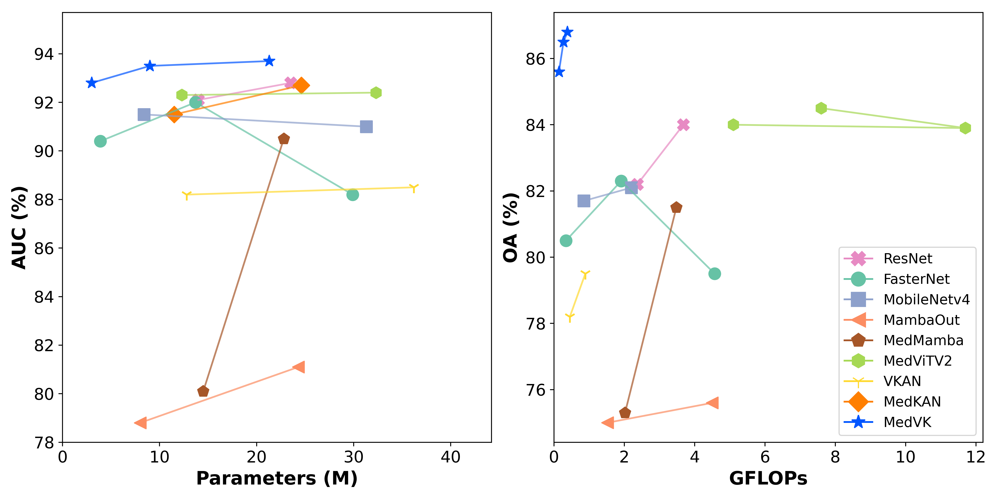
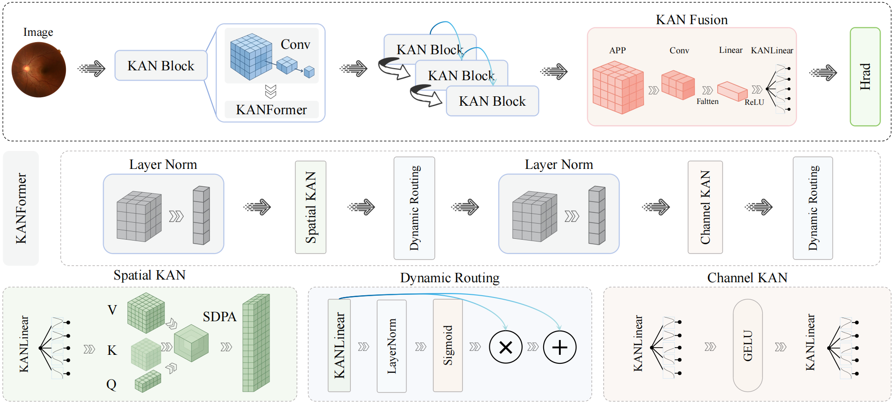

# MedVK

**Official PyTorch implementation of "MedVK: Efficient Medical Image Classification via Decoupled Kolmogorov-Arnold Networks"**

<p align="center">
  
</p>

---

## Overview

MedVK is a lightweight and expressive framework for medical image classification, built on a decoupled Kolmogorov–Arnold Network (KAN). Unlike traditional CNNs, Transformers, or Mamba-based models that rely on fixed activations and coupled feature modeling, MedVK introduces spline-driven nonlinearities and a multi-branch design to improve adaptability, interpretability, and efficiency, especially on complex or small-scale medical datasets.

**Key Challenges:**

❗ Fixed activation functions in CNNs/Transformers fail to adapt to diverse lesion characteristics and subtle anatomical features.

❗ Coupled spatial-channel modeling blurs local texture and global semantic boundaries, harming fine-grained classification.

❗ Overhead of attention-heavy models restricts real-world deployment in clinical or resource-constrained settings.

**Our Solution:**

✅ Replace fixed activations with B-spline-based KAN nonlinearities for adaptive, data-driven representation.

✅ Design a decoupled architecture (KANFormer) that separates spatial and channel-wise modeling into independent, specialized branches.

✅ Introduce a KANFusion module for hierarchical multi-scale feature aggregation with minimal cost.

✅ Provide three variants (Tiny, Small, Base) for flexible deployment across devices and constraints.


### 🎯 Key Features

🔀 Decoupled multi-branch design: Explicitly separates spatial continuity from channel dependency.

🌐 Spline-driven activations: Enables data-adaptive modeling with smooth and interpretable nonlinearities.

⚡ Ultra-efficient: Achieves SOTA performance with up to 30× fewer GFLOPs than prior models.

🧠 Model variants: Choose from MedVK-T, MedVK-S, and MedVK-B based on your accuracy–efficiency needs.

📊 Robust across modalities: Validated on X-ray, ultrasound, dermatoscopy, and retinal imaging.

🔎 Interpretable: Produces focused Grad-CAM heatmaps on lesion areas with improved localization.

### 🚀 Main Contributions

✨ Propose KANFormer, a decoupled vision architecture with spline-enhanced branches for spatial and channel modeling.

✨ Introduce MedVK, integrating KANFormer with a lightweight KANFusion module for effective multi-stage representation fusion.

✨ Achieve SOTA performance on six diverse medical image datasets while being 10–30× more efficient than transformer-based baselines.

✨ Provide a comprehensive ablation study and visualization analysis, validating both effectiveness and interpretability.

---

## 🏗️ Architecture

<div align="center">



*🏗️ Overall Architecture of MedVK.*

</div>


---

## 🛠️ Installation

### Prerequisites

- Python 3.10 (Ubuntu22.04)
- CUDA 11.8
- PyTorch 2.12

### Step-by-Step Installation

```
pip install torch==2.1.2 torchvision==0.16.2 torchaudio
pip install timm==0.9.16 packaging==23.0

pip install pytest==8.3.5 chardet==4.0.0 yacs==0.1.8 termcolor==2.4.0
pip install scikit-learn==1.3.2 matplotlib==3.7.1
pip install SimpleITK scikit-image PyWavelets==1.4.1
```

---

## 📊 Performance Results

MedVK achieves state-of-the-art performance across multiple medical imaging benchmarks. Results shown as **Tiny version** / **Large version**.

<div align="center">

| Dataset | Classes| Imaging Modality | F1-Score (%) | AUC (%) | Kappa (%) |
|:--------|:-------:|:------------:|:----------------:|:-------:|:---------:|
| **[Fetal-Planes-DB](https://zenodo.org/records/3904280)** | 4 | Maternal-fetal Ultrasound | **88.8** / **90.1** | **98.8** / **98.9** | **87.8** / **88.7** |
| **[Kvasir v2](https://datasets.simula.no/kvasir/)** | 8 | Gastrointestinal Endoscope | **88.6** / **88.7** | **99.3** / **99.2** | **86.9** / **87.1** |
| **[BloodMNIST](https://medmnist.com/)** | 8 | Blood Cell Microscope | **98.1** / **98.9** | **99.9** / **100.0** | **98.0** / **98.6** |
| **[DermaMNIST](https://medmnist.com/)** | 7 | Dermatoscope | **66.4** / **67.2** | **95.9** / **95.4** | **65.3** / **65.8** |
| **[OrganCMNIST](https://medmnist.com/)** | 11 | Abdominal CT | **89.0** / **89.9** | **99.3** / **99.5** | **87.8** / **89.4** |
| **[OrganSMNIST](https://medmnist.com/)** | 11 | Abdominal CT | **74.9** / **75.9** | **97.7** / **97.9** | **76.5** / **76.9** |
| **[PneumoniaMNIST](https://medmnist.com/)** | 2 | Chest X-Ray | **92.8** / **95.1** | **99.1** / **98.9** | **85.6** / **90.1** |
| **[RetinaMNIST](https://medmnist.com/)** | 5 | Fundus Camera | **42.4** / **43.5** | **74.0** / **75.7** | **37.5** / **37.5** |

</div>

> **Note:** Pre-trained model weights will be released soon. Stay tuned for updates!

---

## 🚀 Quick Start

### Training Your Model

```bash
# Basic training command
python train.py \
    --model MedVK_T \
    --dataset PneumoniaMNIST \
    --epochs 100 \
    --batch_size 32 \
    --lr 0.0001
```

### Model Evaluation

```bash
# Evaluate single model
python test.py \
    --dataset PneumoniaMNIST \
    --model MedVK_T \
    --checkpoint ./checkpoints/best_model.pth \
    --batch_size 32
```
---

## 🔬 Visualization Results

### Attention Heatmaps

<div align="center">


*🔍 Grad-CAM visualization showing model attention on medical images.*

</div>

Our visualizations demonstrate that MedVK effectively focuses on clinically relevant regions, providing interpretable results for medical professionals.


## 🙏 Acknowledgements

We thank but not limited to following repositories for providing assistance for our research:

- **[MedMamba](https://github.com/YubiaoYue/MedMamba)**
- **[MambaOut](https://github.com/yuweihao/MambaOut)**
- **[EfficientNetV2](https://github.com/d-li14/efficientnetv2.pytorch)**

Special thanks to the medical imaging community for providing high-quality datasets and benchmarks.


