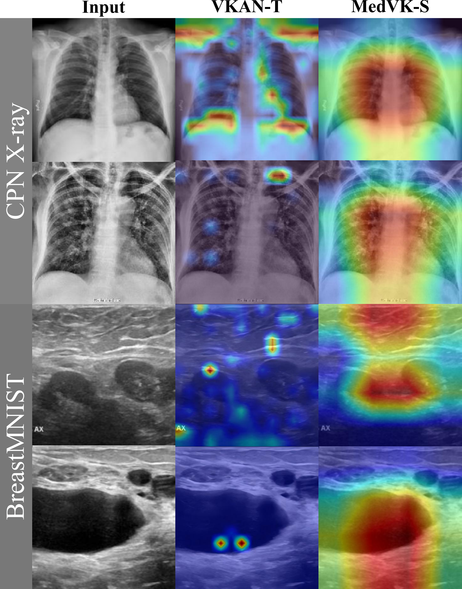

# MedVK

**Official PyTorch implementation of "MedVK: Efficient Medical Image Classification via Decoupled Kolmogorov-Arnold Networks"**

<p align="center">
  
</p>

---


This work has been published in the _Pattern Recognition Letters_: https://www.sciencedirect.com/science/article/pii/S0167865526000851

Anyone you share the following link with will be able to read this content: https://authors.elsevier.com/a/1mnW%7EcAmz31pJ

## Overview

MedVK is a lightweight and expressive framework for medical image classification, built on a decoupled Kolmogorov–Arnold Network (KAN). Unlike traditional CNNs, Transformers, or Mamba-based models that rely on fixed activations and coupled feature modeling, MedVK introduces spline-driven nonlinearities and a multi-branch design to improve adaptability, interpretability, and efficiency, especially on complex or small-scale medical datasets.


**Key Challenges:**

❗ Fixed activation functions in CNNs/Transformers fail to adapt to diverse lesion characteristics and subtle anatomical features.

❗ Coupled spatial-channel modeling blurs local texture and global semantic boundaries, harming fine-grained classification.

❗ Overhead of attention-heavy models restricts real-world deployment in clinical or resource-constrained settings.

**Our Solution:**

✅ Replace fixed activations with B-spline-based KAN nonlinearities for adaptive, data-driven representation.

✅ Design a decoupled architecture (KANFormer) that separates spatial and channel-wise modeling into independent, specialized branches.

✅ Introduce a KANFusion module for hierarchical multi-scale feature aggregation with minimal cost.

✅ Provide three variants (Tiny, Small, Base) for flexible deployment across devices and constraints.


## Architecture

<div align="center">


_*Overall Architecture of MedVK.*_

</div>


### Key Features

**Decoupled multi-branch design:** Explicitly separates spatial continuity from channel dependency.

**Spline-driven activations:** Enables data-adaptive modeling with smooth and interpretable nonlinearities.

**Ultra-efficient:** Achieves SOTA performance with up to 30× fewer GFLOPs than prior models.

**Model variants:** Choose from MedVK-T, MedVK-S, and MedVK-B based on your accuracy–efficiency needs.

**Robust across** modalities: Validated on X-ray, ultrasound, dermatoscopy, and retinal imaging.

**Interpretable:** Produces focused Grad-CAM heatmaps on lesion areas with improved localization.

###  Main Contributions

✨ Propose KANFormer, a decoupled vision architecture with spline-enhanced branches for spatial and channel modeling.

✨ Introduce MedVK, integrating KANFormer with a lightweight KANFusion module for effective multi-stage representation fusion.

✨ Achieve SOTA performance on six diverse medical image datasets while being 10–30× more efficient than transformer-based baselines.

✨ Provide a comprehensive ablation study and visualization analysis, validating both effectiveness and interpretability.

---

---

##  Installation

### Prerequisites

- Python 3.10 (Ubuntu22.04)
- CUDA 11.8
- PyTorch 2.12

### Step-by-Step Installation

```
pip install torch==2.1.2 torchvision==0.16.2 torchaudio
pip install timm==0.9.16 packaging==23.0

pip install pytest==8.3.5 chardet==4.0.0 yacs==0.1.8 termcolor==2.4.0
pip install scikit-learn==1.3.2 matplotlib==3.7.1
pip install SimpleITK scikit-image PyWavelets==1.4.1
```

---

##  Performance Results

MedVK achieves state-of-the-art performance across multiple medical imaging benchmarks. Results shown as **Tiny version** / **Small version** / **Base version**.

<div align="center">

| Dataset | Classes | Imaging Modality | F1-Score (%) ↑| OA (%) ↑| AUC (%) ↑| Kappa (%) ↑|
|:--------|:-------:|:--------------------------:|:----------------------:|:----------------------:|:------------------:|:------------------:|
| **[BloodMNIST](https://medmnist.com/)** | 8 | Blood Cell Microscope | 98.7 / 98.6 / 98.5 | 98.6 / 98.5 / 98.5 | 99.9 / 99.9 / 99.9 | 98.4 / 98.3 / 98.2 |
| **[BreastMNIST](https://medmnist.com/)** | 2 | Breast Ultrasound | 78.3 / 80.9 / 79.0 | 84.6 / 85.9 / 85.3 | 86.3 / 86.7 / 88.1 | 57.0 / 61.9 / 58.5 |
| **[DermaMNIST](https://medmnist.com/)** | 7 | Dermatoscope | 61.6 / 63.4 / 63.1 | 80.3 / 81.0 / 80.9 | 94.2 / 94.8 / 94.6 | 61.5 / 63.8 / 62.0 |
| **[PneumoniaMNIST](https://medmnist.com/)** | 2 | Chest X-Ray | 96.6 / 97.1 / 96.6 | 96.8 / 97.3 / 96.8 | 99.2 / 99.6 / 99.0 | 93.1 / 94.1 / 93.1 |
| **[RetinaMNIST](https://medmnist.com/)** | 5 | Fundus Camera | 39.9 / 36.2 / 39.9 | 56.5 / 57.0 / 57.8 | 76.0 / 74.3 / 75.7 | 37.3 / 37.6 / 40.0 |
| **[CPN X-ray](https://example.com/)** | 3 | Chest X-ray | 96.3 / 96.6 / 96.8 | 96.3 / 96.6 / 96.8 | 99.5 / 99.5 / 99.4 | 94.4 / 94.8 / 95.1 |

</div>

### Average Performance Comparison Across Six Datasets

<div align="center">
  
| Model             | F1-Score<sub>avg</sub> (%) ↑| OA<sub>avg</sub> (%) ↑| AUC<sub>avg</sub> (%) ↑| Kappa<sub>avg</sub> (%) ↑| Params (M) ↓| GFLOPs ↓|
|-------------------|------------------|------------------|-------------------|---------------------|------------|--------|
| FasterNet-T0      | 72.5             | 80.5             | 90.4              | 63.5                | 3.9        | 0.34   |
| StarNet-S2        | 76.6             | 83.1             | 89.5              | 70.1                | 3.7        | 0.55   |
| **MedVK-T**       | **78.7**         | **85.6**         | **92.8**          | **73.9**            | **3.0**    | **0.14** |
| ResNet18          | 76.2             | 82.2             | 92.1              | 67.9                | 14.0       | 2.37   |
| FasterNet-T2      | 75.4             | 82.3             | 92.0              | 68.3                | 13.7       | 1.91   |
| MobileNetV4-M     | 76.5             | 81.7             | 91.5              | 68.2                | 8.4        | 0.85   |
| MambaOut-kobe     | 64.7             | 75.0             | 78.8              | 55.0                | **8.0**    | 1.52   |
| MedMamba-T        | 66.4             | 75.3             | 80.1              | 54.2                | 14.5       | 2.02   |
| MedViTV2-T*       | ---              | 84.0             | 92.3              | ---                 | 12.3       | 5.10   |
| VKAN-T            | 71.3             | 78.2             | 88.2              | 63.0                | 12.8       | 0.45   |
| MedKAN-T*         | ---              | 83.7             | 91.5              | ---                 | 11.5       | ---    |
| **MedVK-S**       | **80.2**         | **86.5**         | **93.5**          | **74.9**            | 9.0        | **0.27** |
| ResNet50          | 78.1             | 84.0             | 92.8              | 71.8                | 23.5       | 3.68   |
| ConvNeXt          | 70.2             | 78.0             | 87.0              | 62.5                | 27.8       | 4.49   |
| FasterNet-S       | 72.5             | 79.5             | 88.2              | 64.7                | 29.9       | 4.57   |
| MobileNetV4-L     | 76.0             | 82.1             | 91.0              | 68.0                | 31.3       | 2.20   |
| SepViT-T          | 75.5             | 82.2             | 91.6              | 67.9                | 33.6       | 4.36   |
| MambaOut-T        | 66.4             | 75.6             | 81.1              | 55.8                | 24.3       | 4.50   |
| MedMamba-L        | 74.5             | 81.5             | 90.5              | 67.3                | 22.8       | 3.48   |
| MedViT-T*         | ---              | 83.9             | 91.9              | ---                 | 31.1       | 11.70  |
| MedViTV2-S*       | ---              | 84.5             | 92.4              | ---                 | 32.3       | 7.60   |
| VKAN-S            | 72.5             | 79.5             | 88.5              | 64.2                | 36.2       | 0.89   |
| MedKAN-B*         | ---              | 85.0             | 92.7              | ---                 | 24.6       | ---    |
| **MedVK-B**       | **80.5**         | **86.8**         | **93.7**          | **75.3**            | **21.3**   | **0.38** |
</div>

> **Note:** Pre-trained model weights will be released soon. Stay tuned for updates!

---

##  Quick Start

### Training Your Model

```bash
# Basic training command
python train.py \
    --model MedVK_T \
    --dataset PneumoniaMNIST \
    --epochs 100 \
    --batch_size 32 \
    --lr 0.0001
```

### Model Evaluation

```bash
# Evaluate single model
python test.py \
    --dataset PneumoniaMNIST \
    --model MedVK_T \
    --checkpoint ./checkpoints/best_model.pth \
    --batch_size 32
```
---

##  Visualization Results

### Attention Heatmaps

<div align="center">



_* Grad-CAM visualization showing model attention on medical images.*_
</div>

Our visualizations demonstrate that MedVK effectively focuses on clinically relevant regions, providing interpretable results for medical professionals.

If you think that our work is useful to your research, please cite using this BibTeX😊:
## Citation
```bibtex

@article{PAN2026152,
title = {MedVK: Efficient medical image classification via decoupled vision Kolmogorov-Arnold Networks},
journal = {Pattern Recognition Letters},
volume = {203},
pages = {152-159},
year = {2026},
issn = {0167-8655},
doi = {https://doi.org/10.1016/j.patrec.2026.03.004},
url = {https://www.sciencedirect.com/science/article/pii/S0167865526000851},
author = {Weichao Pan and Xu Wang}
}
```
